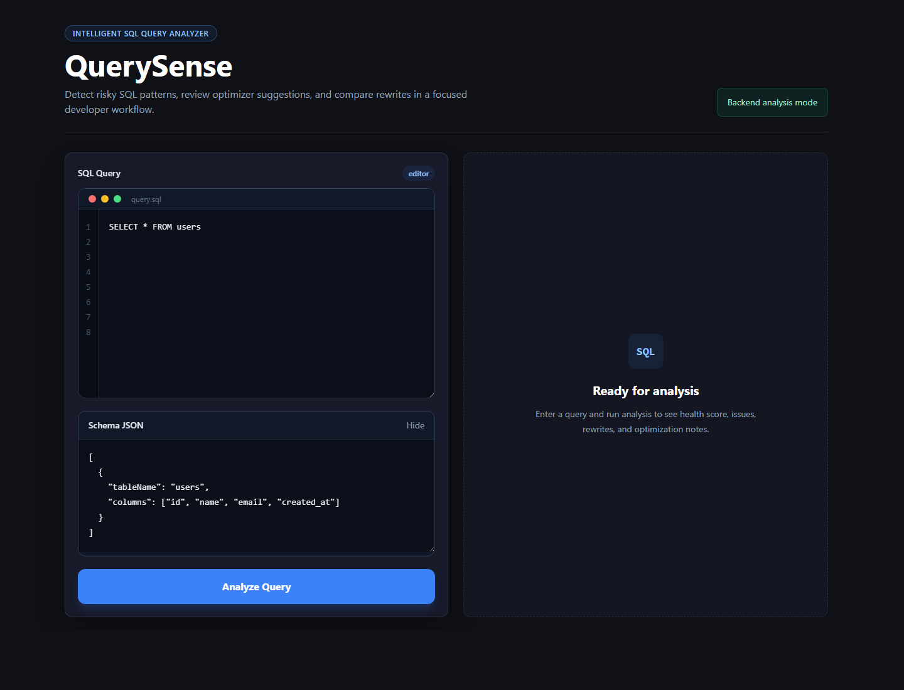
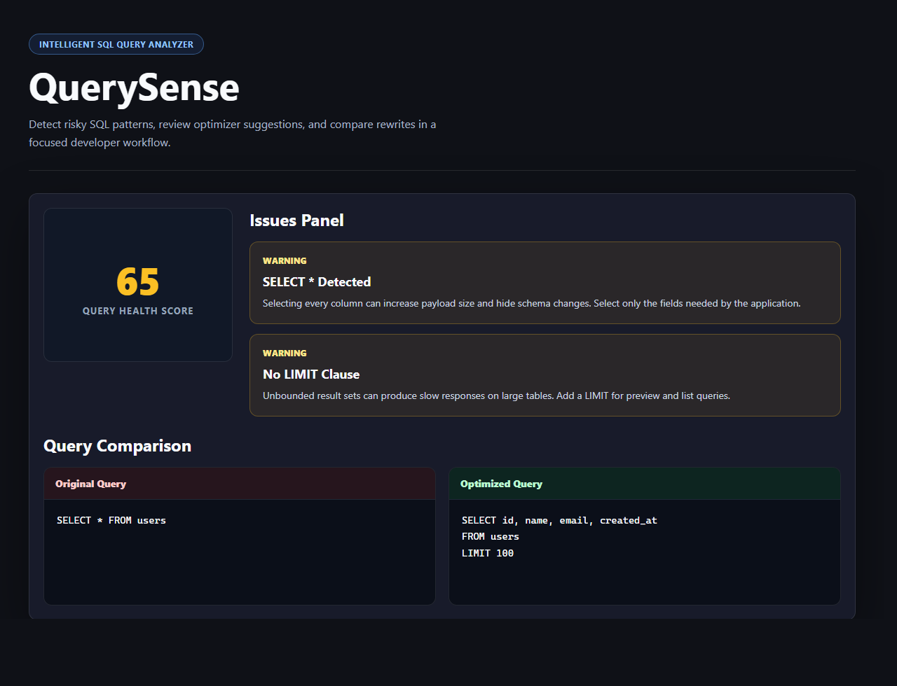
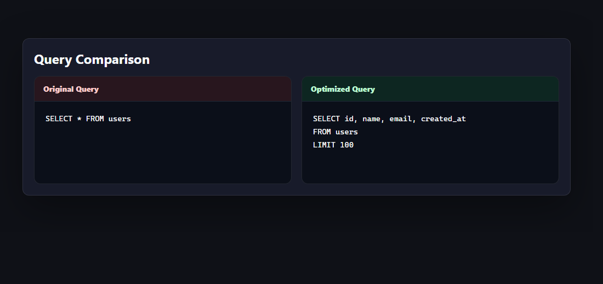

# QuerySense - Intelligent SQL Query Analyzer

Analyze SQL queries before they hit production.

QuerySense detects SQL anti-patterns, missing indexes, inefficient query structures, and provides optimized query suggestions with explanations.

---

## Live Demo

Frontend: https://query-sense-delta.vercel.app/

Backend API: https://querysense-production-613a.up.railway.app

---

## Features

- Detects SELECT * anti-patterns
- Detects missing WHERE clauses
- Detects missing LIMIT clauses
- Detects missing indexes
- Detects Cartesian joins
- Detects N+1 query patterns
- Detects functions on indexed columns
- Detects correlated subqueries
- Query health score (0-100)
- Optimized query rewrite suggestions
- Severity-based issue reporting

---

## Tech Stack

### Backend

- Java 17
- Spring Boot 3
- Maven
- JSQLParser

### Frontend

- React
- Vite
- Axios

### Deployment

- Railway
- Vercel

---

## Architecture

```text
React Frontend
      │
      ▼
Spring Boot REST API
      │
      ▼
JSQLParser
      │
      ▼
Rule Engine
      │
      ▼
Analysis Report
```

---

## API Endpoint

### POST /api/analyze

Request

```json
{
  "query": "SELECT * FROM orders WHERE customer_id = 5",
  "schema": []
}
```

Response

```json
{
  "score": 75,
  "issues": [
    {
      "title": "SELECT * Detected",
      "severity": "CRITICAL"
    }
  ],
  "optimizedQuery": "SELECT id, amount FROM orders WHERE customer_id = 5"
}
```

---

## Run Locally

### Backend

```bash
cd querysense-backend
mvn spring-boot:run
```

Runs on:

```text
http://localhost:8080
```

### Frontend

```bash
cd querysense-frontend
npm install
npm run dev
```

Runs on:

```text
http://localhost:5173
```

---

## Screenshots

### Query Input



### Analysis Results



### Query Comparison



---

## Project Structure

```text
querysense-backend/
├── controller/
├── service/
├── rules/
├── model/
└── config/

querysense-frontend/
├── components/
├── services/
└── App.jsx
```

---

## Future Improvements

- MySQL EXPLAIN Plan integration
- VS Code extension
- GitHub Action integration
- Batch query analysis
- Query performance benchmarking
- Database-specific optimization recommendations

---

## Author

**Sanju**

BCA, VIT-AP University

2026

---

## Why QuerySense?

Modern applications often fail because of inefficient database queries rather than incorrect business logic. QuerySense helps developers identify performance issues before deployment by analyzing SQL queries and providing actionable recommendations.

This project demonstrates:

- Java backend development
- Spring Boot REST API development
- SQL parsing with JSQLParser
- Rule Engine design pattern
- React frontend development
- Full-stack deployment using Railway and Vercel